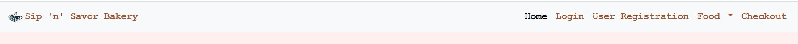
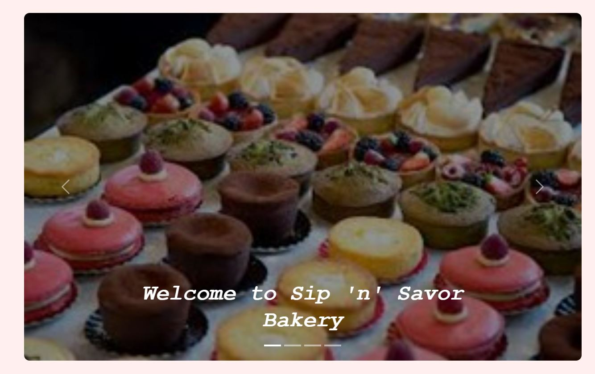
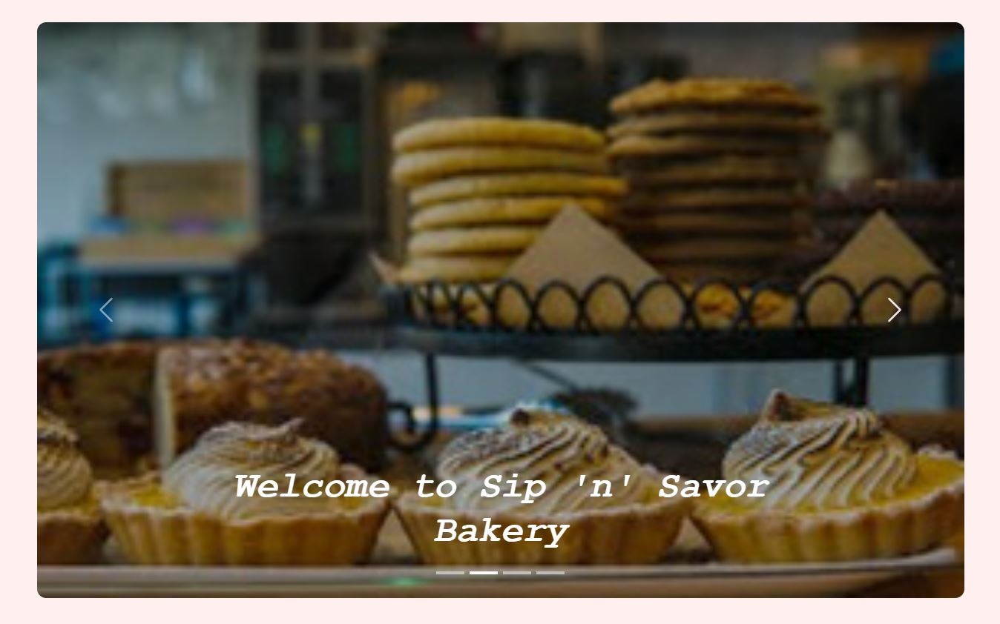
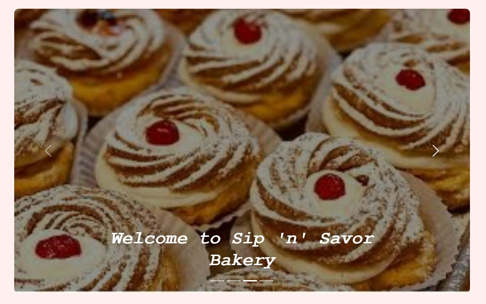
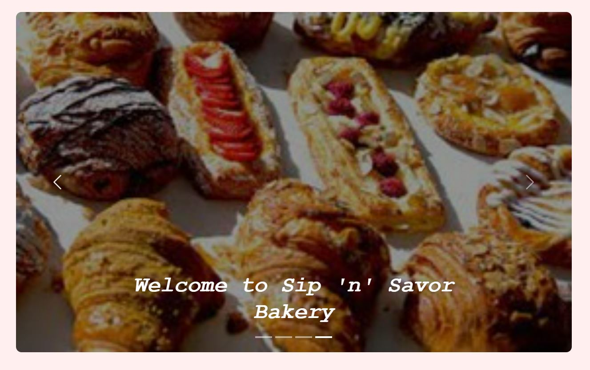
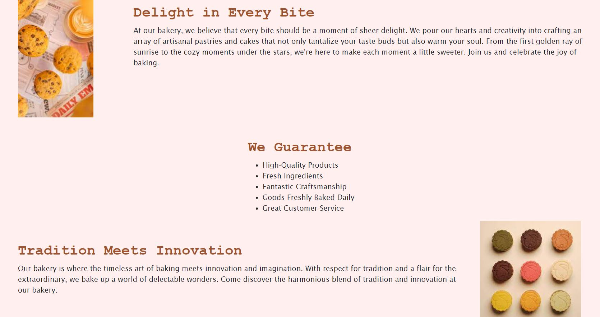

# Bakery E-Commerce Website

A basic e-commerce website, consisting of six pages, made with HTML, CSS, and Bootstrap where products can be sold.

## Home Page
The home page starts with a nav bar at the top.

_Navigation bar spans across **ALL** pages and highlights the current page the user is on._

For added visual appeal there is a carousel containing four images.
_There are arrows on **BOTH** sides of the images and a selction bar at the bottom to help navigate through pictures._

The bottom simply contains text about the website/business and what is offered there.

## Login Page
## Registration Page
## Sweets Page
## Drinks Page
## Ckeckout Page