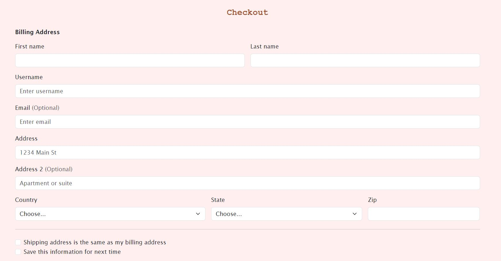
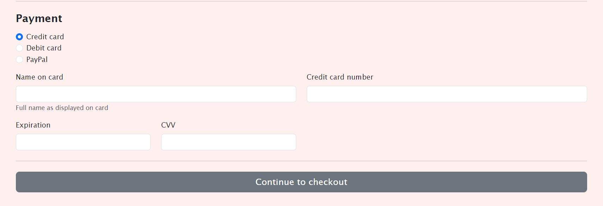
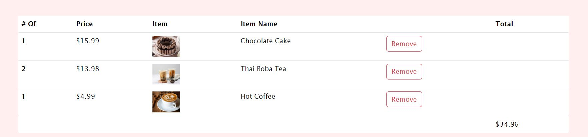

# Bakery E-Commerce Website

A basic e-commerce website, consisting of six pages, made with HTML, CSS, and Bootstrap where products can be sold.

## Home Page
***
The home page starts with a nav bar at the top.

_Navigation bar spans across **ALL** pages and highlights the current page the user is on._

For added visual appeal there is a carousel containing four images.

_There are arrows on **BOTH** sides of the images and a selction bar at the bottom to help navigate through pictures._

The bottom simply contains text about the website/business and what is offered there.

## Login Page
***
The next page is the login that contains a simple login form

_The end of the page contains a link that leads to the registration form._

## Registration Page
***
Next is the registration page that allows new users to create an account.

## Sweets Page
***
The sweets page contains baked goods offered by the buisness.

Each sweet dispalys:
-The item
-An image
-A small description
-The variations

## Drinks Page
***
Similar to the sweets page the drinks page shows the different drinks offers bt the buisness.

Each drink card displays:
-The item
-An image
-A small description
-The variations

## Ckeckout Page
***
The checkout page contains a simple form that requires users to input their information in order to make a purchase.

_Users payment method is also requires so there is an area for it._

The products in the users cart are shown at the bottom of the page. 

_The price of each item and their calculated total is also shown._